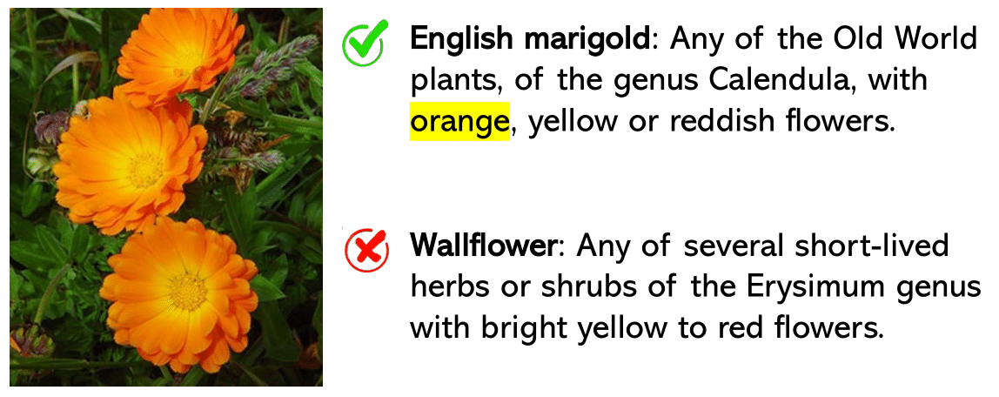

# [K-LITE: Learning Transferable Visual Models with External Knowledge ](https://arxiv.org/pdf/2204.09222.pdf)

This is the official Pytorch implementation of KLITE:

["**K-LITE: Learning Transferable Visual Models with External Knowledge. NeurIPS 2022 (oral)**"](https://arxiv.org/pdf/2204.09222.pdf0) by 

[Sheng Shen*](https://sincerass.github.io/), [Chunyuan Li*](https://chunyuan.li/), [Xiaowei Hu](https://scholar.google.com/citations?user=Pj0TwxwAAAAJ&hl=en), [Yujia Xie](https://scholar.google.com/citations?user=r2FiAE4AAAAJ&hl=en), [Jianwei Yang](https://jwyang.github.io/), [Xiaowei Hu](https://scholar.google.com/citations?user=Pj0TwxwAAAAJ&hl=en), [Pengchuan Zhang](https://pzzhang.github.io/pzzhang/), [Zhe Gan](https://zhegan27.github.io/), [Lijuan Wang](https://scholar.google.com/citations?user=cDcWXuIAAAAJ&hl=zh-CN), [Lu Yuan](https://scholar.google.com/citations?user=k9TsUVsAAAAJ&hl=en), [Ce Liu](http://people.csail.mit.edu/celiu/), [Kurt Keutzer](http://people.eecs.berkeley.edu/~keutzer/), [Trevor Darrell](https://people.eecs.berkeley.edu/~trevor/), [Anna Rohrbach](https://anna-rohrbach.net/) and [Jianfeng Gao](https://www.microsoft.com/en-us/research/people/jfgao/?from=http%3A%2F%2Fresearch.microsoft.com%2Fen-us%2Fum%2Fpeople%2Fjfgao%2F).

## Introduction

<p align="center">
  
  
</p>

In this paper,  we propose **K-LITE**, a simple strategy to leverage **external knowledge** for building transferable visual systems: In training, it enriches entities in text with WordNet and Wiktionary knowledge, leading to an **efficient and scalable approach** to learning image representations that uses knowledge about the visual concepts. In evaluation, the text is also augmented with external knowledge and then used to reference learned visual concepts (or describe new ones) to enable zero-shot and few-shot transfer of the pre-trained models. We study the performance of K-LITE on two important computer vision problems,
image classification (IC) and object detection (OD) in [ELEVATER](https://computer-vision-in-the-wild.github.io/ELEVATER/) benchmark, on 20 and 13 different existing datasets, respectively. The proposed knowledge-augmented models show **6.29%** average improvement on 20 IC tasks and **4.2%** average improvement on 13 OD tasks in performance over existing methods. 

We provide two illustrative examples why **K-LITE** could be helpful from Oxford-Flowers and Food-101 IC tasks. 

<p align="center">
  
  
</p>


## Benchmarking

### UniCL training with image-label data and image-text pairs
<!-- | Swin-T | IN-21K | 28.5 | 37.8 | - | [ckpt](https://projects4jw.blob.core.windows.net/unicl/release/in21k.pth)/[config](configs/klite_swin_tiny.yaml) -->
| Model | Training Set | ZS on IN-1K | ZS on 20 datasets | Download
| :----: | :---: | :---: | :---: | :---: |
| Swin-T | IN-21K | 28.5 | 27.1 | [ckpt](https://projects4jw.blob.core.windows.net/unicl/release/in21k.pth)/[config](configs/klite_swin_tiny.yaml)
| Swin-T | IN-21K + GCC-15M | 46.9 | 39.8 | [ckpt](https://cvinw.blob.core.windows.net/model/unicl/in21k_gcc15m/tiny/model_state_dict.pt)/[config](configs/klite_swin_tiny.yaml)
| Swin-T | IN-21K + GCC-15M + YFCC-14M | 49.3 | 40.5 | [ckpt](https://cvinw.blob.core.windows.net/model/unicl/in21k_gcc15m_yfcc14m/tiny/model_state_dict.pt)/[config](configs/klite_swin_tiny.yaml)
| Swin-B | IN-21K + GCC-15M | 50.0 | 39.4 | [ckpt](https://cvinw.blob.core.windows.net/model/unicl/in21k_gcc15m/base/model_state_dict.pt)/[config](configs/klite_swin_tiny.yaml)
| Swin-B | IN-21K + GCC-15M + YFCC-14M | 52.3 | 42.5 | [ckpt](https://cvinw.blob.core.windows.net/model/unicl/in21k_gcc15m_yfcc14m/base/model_state_dict.pt)/[config](configs/unicl_swin_base.yaml)


### K-LITE training with image-label data and image-text pairs augmented by knowledge data

| Model | Training Set | ZS on IN-1K | ZS on 20 datasets| Download
| :----: | :---: | :---: | :---: | :---: |
| Swin-T | IN-21K |  32.0 | 33.8 | [ckpt](https://cvinw.blob.core.windows.net/model/klite/in21k/tiny/model_state_dict.pt)/[config](configs/klite_swin_tiny.yaml)
| Swin-T | IN-21K + GCC-15M |  51.6  | 42.3 | [ckpt](https://cvinw.blob.core.windows.net/model/klite/in21k_gcc15m/tiny/model_state_dict.pt)/[config](configs/klite_swin_tiny.yaml)
| Swin-T | IN-21K + GCC-15M + YFCC-14M |  51.9 | 41.6 | [ckpt](https://cvinw.blob.core.windows.net/model/klite/in21k_gcc15m_yfcc14m/tiny/model_state_dict.pt)/[config](configs/klite_swin_tiny.yaml)
| Swin-B | IN-21K + GCC-15M |  55.0  | 43.6 | [ckpt](https://cvinw.blob.core.windows.net/model/klite/in21k_gcc15m/base/model_state_dict.pt)/[config](configs/klite_swin_base.yaml)
| Swin-B | IN-21K + GCC-15M + YFCC-14M |  58.0 | 44.8 | [ckpt](https://cvinw.blob.core.windows.net/model/klite/in21k_gcc15m_yfcc14m/base/model_state_dict.pt)/[config](configs/klite_swin_base.yaml)

**NOTE**: Setting "ZS on 20 datasets" is used in the ICinW benchmark. All the above models are trained **without** strong data augmentations like mixup and cutmix.

## Getting Started
### Setup

To setup the environment, please run 
```bash
pip install -r requirements.txt
pip install -e .
```
Note that for run `main.py` for potential training and evaluation, you need to install [apex](https://github.com/NVIDIA/apex). 

Also, see [klite/load_wiki](https://github.com/microsoft/klite/load_wiki) for constructing image-text pairs or image-label data (train/validation) augmented by knowledge. 

### Data preparation

Please following [DATA.md](./DATA.md) for data preparation.

### **Evaluation**

#### **ImageNet Evaluation**

To evaluate a pre-trained K-LITE on ImageNet val, run:

```bash
python -m torch.distributed.launch --nproc_per_node <num-of-gpus-to-use> --master_port 12345 main.py --eval \
--cfg <config-file> --resume <checkpoint> --data-path <imagenet-path>  --use_knowledge
```
or
```bash
MODE: pretrain method (klite or unicl)
NGPUS: number of gpus
CFG: model config (configs/klite_swin_tiny.yaml or configs/klite_swin_base.yaml)
CKPT_DIR: directory to the ckeckpoint
IMAGENETPATH: path to ImageNet

bash scripts/run_in1k_eval.sh $MODE $NGPUS $CFG $CKPT_DIR $IMAGENETPATH
```

For example, to evaluate the KLITE-Swin-Tiny trained on IN-21K + GCC-15M with a single GPU:

```bash
python -m torch.distributed.launch --nproc_per_node 1 --master_port 12345 main.py --eval \
--cfg configs/klite_swin_tiny.yaml --resume ckpt/klite/in21k_gcc15m/tiny/model_state_dict.pt --data-path <imagenet-path>  --use_knowledge
```

#### **20 ELEVATER Image Classification  tasks Evaluation**
For evaluating KLITE for downstream image classification tasks, and comparing performance on the same task suite, we include the [evaluation toolkit](https://github.com/Computer-Vision-in-the-Wild/Elevater_Toolkit_IC) here at `klite/vision_bechmark/`. Please run the [setup](#setup) before evalutaing on the 20 [ELEVATER](https://computer-vision-in-the-wild.github.io/ELEVATER/) Image Classification tasks. 

Then, to evaluate a pre-trained K-LITE on 20 [ELEVATER](https://computer-vision-in-the-wild.github.io/ELEVATER/) Image Classification tasks in a zero-shot way, run:

```bash
MODE: pretrain method (klite or unicl)
CFG: model config (clip_swin_tiny or clip_swin_base)
CKPT_PATH: path to the checkpoint 
CKPT_ID: the dataset used to pretrain the model (in21k, in21k_gcc15m, in21k_gcc15m_yfcc14m)

bash scripts/run_elevater_eval.sh $MODE $CFG $CKPT_PATH $CKPT_ID
```

For example, to evaluate the KLITE-Swin-Tiny trained on IN-21K + GCC-15M with a single GPU:

```bash
CUDA_VISIBLE_DEVICES=0 bash  scripts/run_elevater_eval.sh klite clip_swin_tiny ckpt/klite/in21k_gcc15m_yfcc14m/tiny/model_state_dict.pt
```


More details for [ELEVATER](https://computer-vision-in-the-wild.github.io/ELEVATER/) benchmark can be found: [[Benchmark]](https://computer-vision-in-the-wild.github.io/ELEVATER/) [[Toolkit]](https://github.com/Computer-Vision-in-the-Wild/Elevater_Toolkit_IC) [[Paper]](https://arxiv.org/abs/2204.08790)

## Citation

If you find this repo useful to your project, please consider to cite it with following bib:

```
@inproceedings{shen2022k,
    title={K-lite: Learning transferable visual models with external knowledge},
    author={Shen, Sheng and Li, Chunyuan and Hu, Xiaowei and Xie, Yujia and Yang, Jianwei and Zhang, Pengchuan and Rohrbach, Anna and Gan, Zhe and Wang, Lijuan and Yuan, Lu and others},
    booktitle={NeurIPS},
    year={2022}
}
```
## Acknowledgement

Our codebase is built based on [UniCL](https://github.com/microsoft/UniCL) and [ELEVATER](https://github.com/Computer-Vision-in-the-Wild/Elevater_Toolkit_IC).

## Contributing

This project welcomes contributions and suggestions.  Most contributions require you to agree to a
Contributor License Agreement (CLA) declaring that you have the right to, and actually do, grant us
the rights to use your contribution. For details, visit https://cla.opensource.microsoft.com.

When you submit a pull request, a CLA bot will automatically determine whether you need to provide
a CLA and decorate the PR appropriately (e.g., status check, comment). Simply follow the instructions
provided by the bot. You will only need to do this once across all repos using our CLA.

This project has adopted the [Microsoft Open Source Code of Conduct](https://opensource.microsoft.com/codeofconduct/).
For more information see the [Code of Conduct FAQ](https://opensource.microsoft.com/codeofconduct/faq/) or
contact [opencode@microsoft.com](mailto:opencode@microsoft.com) with any additional questions or comments.

## Trademarks

This project may contain trademarks or logos for projects, products, or services. Authorized use of Microsoft 
trademarks or logos is subject to and must follow 
[Microsoft's Trademark & Brand Guidelines](https://www.microsoft.com/en-us/legal/intellectualproperty/trademarks/usage/general).
Use of Microsoft trademarks or logos in modified versions of this project must not cause confusion or imply Microsoft sponsorship.
Any use of third-party trademarks or logos are subject to those third-party's policies.
